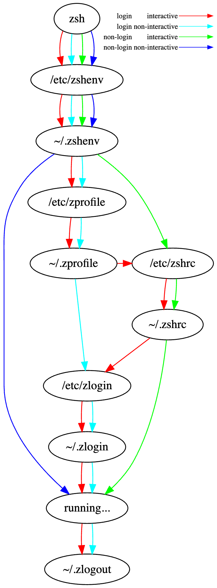

# `zsh` setup

The list and order of [startup files for zsh][zshug] (Ch 2) are (`ZDOTDIR` if not set defaults to `HOME`):

1. `/etc/zshenv`  
  Always run for every zsh. (not present on my MBP)
1. `$ZDOTDIR/.zshenv`  
  Usually run for every zsh (see below).
1. `/etc/zprofile`  
  Run for login shells.
1. `$ZDOTDIR/.zprofile`  
  Run for login shells.
1. `/etc/zshrc`  
  Run for interactive shells.
1. `$ZDOTDIR/.zshrc`  
  Run for interactive shells.
1. `/etc/zlogin`  
  Run for login shells. (not present on my MBP)
1. `$ZDOTDIR/.zlogin`  
  Run for login shells.


## `/etc/zshenv` and `$ZDOTDIR/.zshenv`
`/etc/zshenv` does not exist on macOS.

`$ZDOTDIR/.zshenv` is for user-defined env variables, it is run by every shell invocation.
I added sourcing of `.zprofile` for non-interactive, non-login shells.


## `/etc/zprofile` and `$ZDOTDIR/.zprofile`
`/etc/zprofile` on macOS executes
```shell
$ eval `/usr/libexec/path_helper -s`
```
that sets and exports the system-wide `PATH` and `MANPATH`


[zshug]: <https://zsh.sourceforge.io/Guide/> "zsh user Guide"

# Diagram and possible generalization
A nice diagram and possible generalization for different shells comes from
[this blog post](https://blog.flowblok.id.au/2013-02/shell-startup-scripts.html)
and [its companion repo](https://heptapod.host/flowblok/shell-startup).

The possible paths are:
* **${\color{red}\longrightarrow}$**: login, interactive
* ORANGE: login, non-interactive
* GREEN: non-login, interactive
* BLUE: non-login, non-interactive




# Secretes
for now I keep a non version controlled file `.secret_keys`
